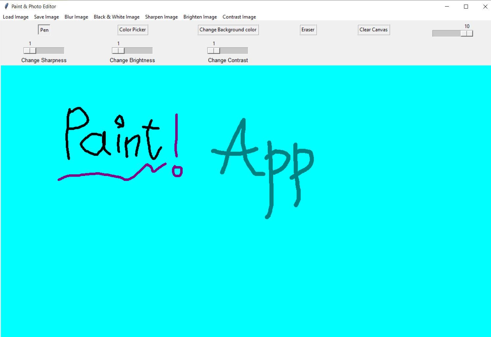
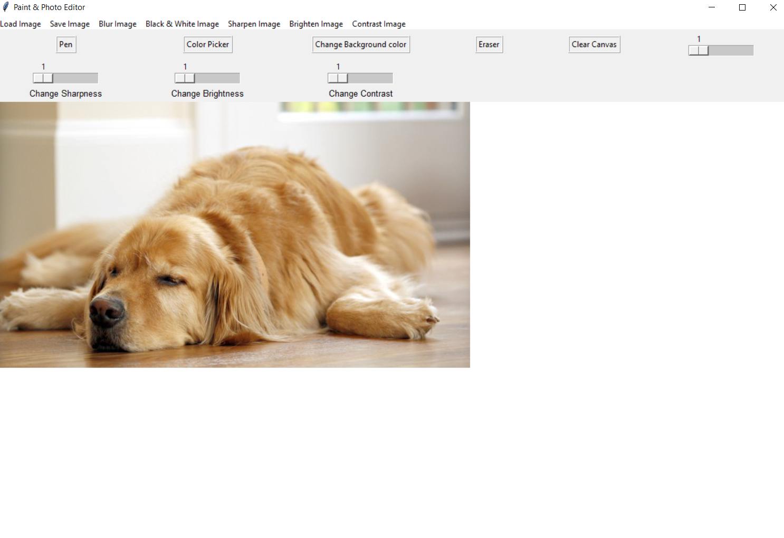
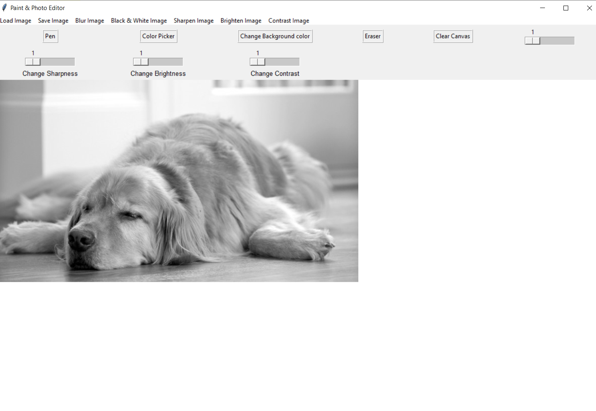
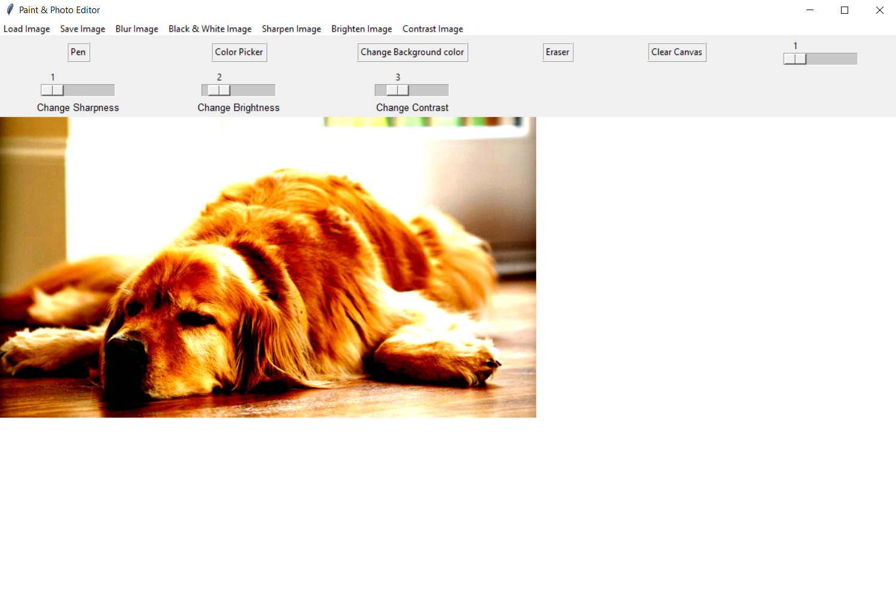
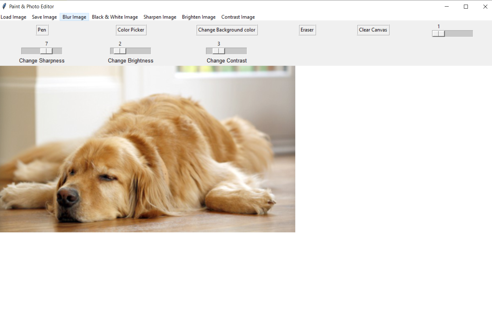
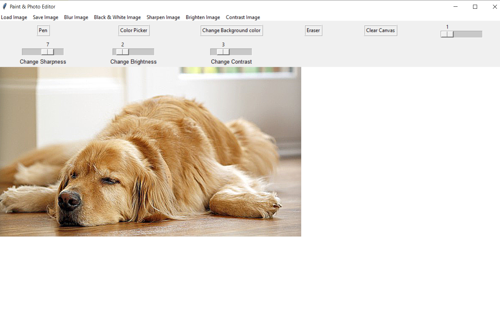

# Paint-and-Photo-Editor-Application

It is a simple application built using Tkinter and Pillow library in Python to combine a paint application and a photo editor.
The features can be tested by running the application.
First install the required modules and run the .py file

A simple demo of the Paint Application:-

Loading a simple image to edit in the Application:-

Some features of the editor:-

Black & White Effect                  |                   Contrast Effect
:---------------------------------:        |      :------------------------------:
     |      

Blur Image Effect                  |                   Sharp Image Effect
:---------------------------------:        |      :------------------------------:
     |      
